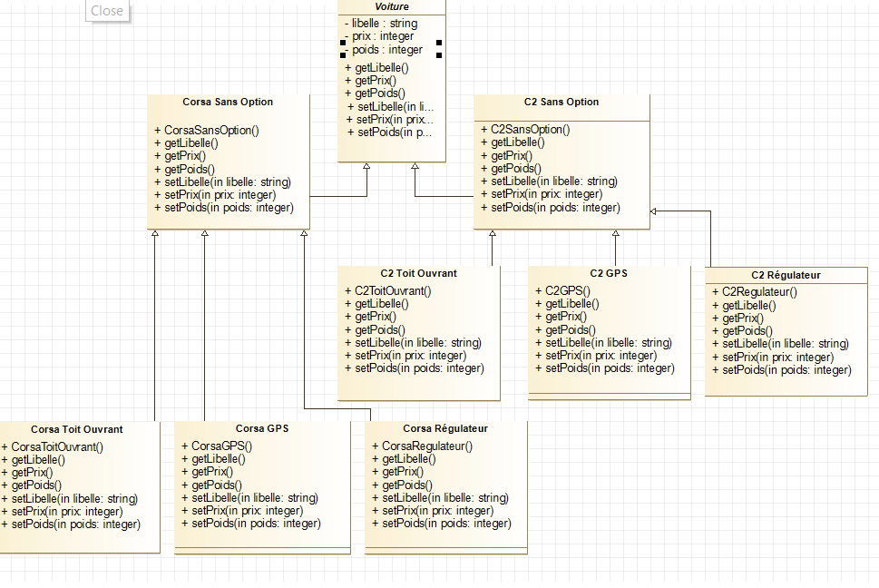
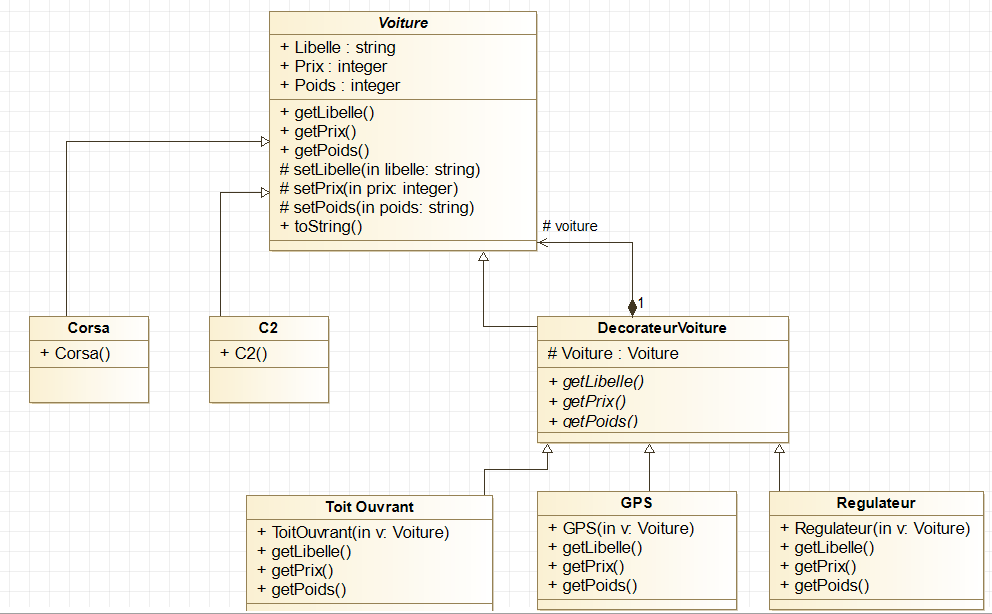

# Java Example : Design Pattern Decorator - USE CASE

Now imagine a dealership that must sell cars with or without options.

We could imagine the following uml: 

  

But we realize that the decorator design pattern is much more interesting! Indeed, with the design pattern we arrive at a much simpler UML: 

  

___
## Contributing ❤

👋🏾 Pull requests are welcome! 
___

## Issue Reporting

If you have found a bug or if you have a feature request, please report them at this repository issues section. Please do not report security vulnerabilities on the public GitHub issue tracker. The [Responsible Disclosure Program](mailto:support@orbitturner.com) details the procedure for disclosing security issues.
___

## GREETINGS
❤❤ *Coming Soon !* ❤❤

___
## Author

[Orbit Turner](https://orbitturner.com)

___
## License

This project is licensed under the MIT license. See the [LICENSE](LICENSE) file for more info.
______________________________________________________
**❤ MADE WITH LOVE ❤**

