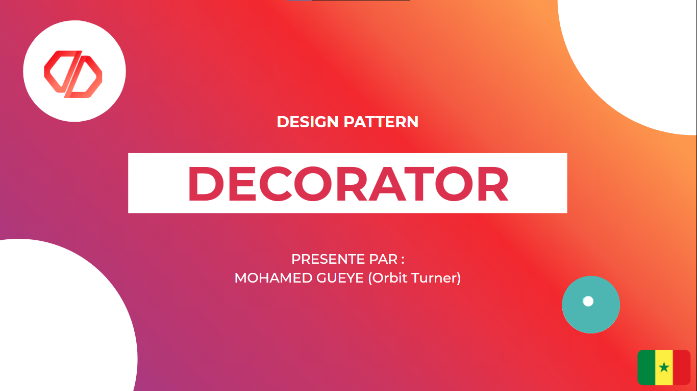

# 🎨 DESIGN PATTERN : DECORATOR 📚

**The Decorator pattern** is a [Structural Design Pattern](https://www.wikiwand.com/en/Structural_pattern).
Decorator allows us to add ("decorate") new functionality to a class dynamically without impacting the classes that use or inherit it. 

  

<h1 align="center">📑 USAGE 👁‍🗨</h1>

 

___
## Contributing ❤

👋🏾 Pull requests are welcome! 
___

## Issue Reporting

If you have found a bug or if you have a feature request, please report them at this repository issues section. Please do not report security vulnerabilities on the public GitHub issue tracker. The [Responsible Disclosure Program](mailto:support@orbitturner.com) details the procedure for disclosing security issues.
___

## GREETINGS
❤❤ *Coming Soon !* ❤❤

___
## Author

[Orbit Turner](https://orbitturner.com)

___
## License

This project is licensed under the MIT license. See the [LICENSE](LICENSE) file for more info.
______________________________________________________
**❤ MADE WITH LOVE ❤**

